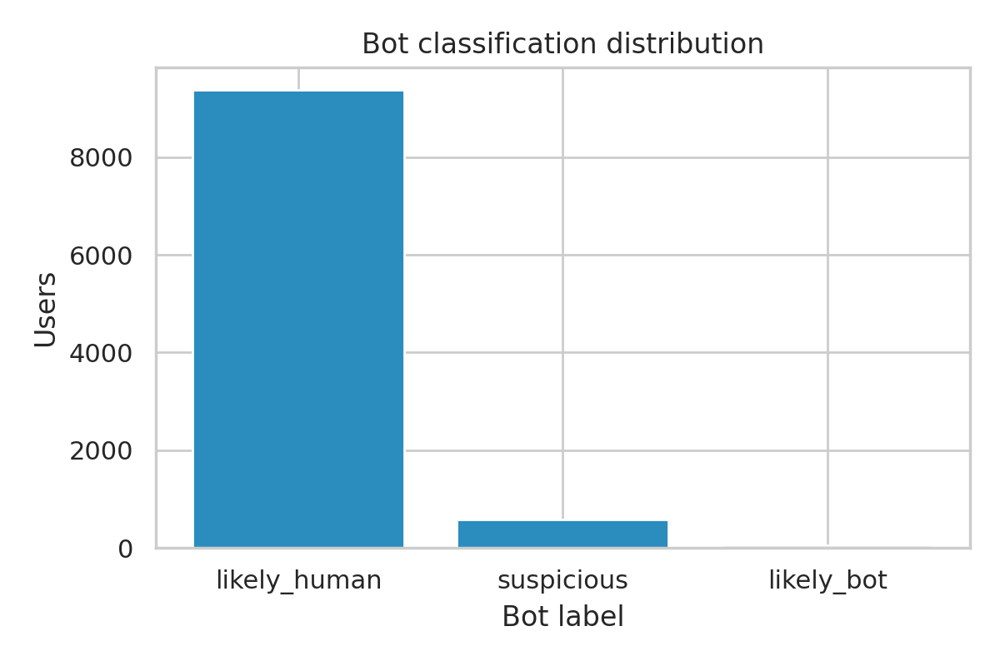
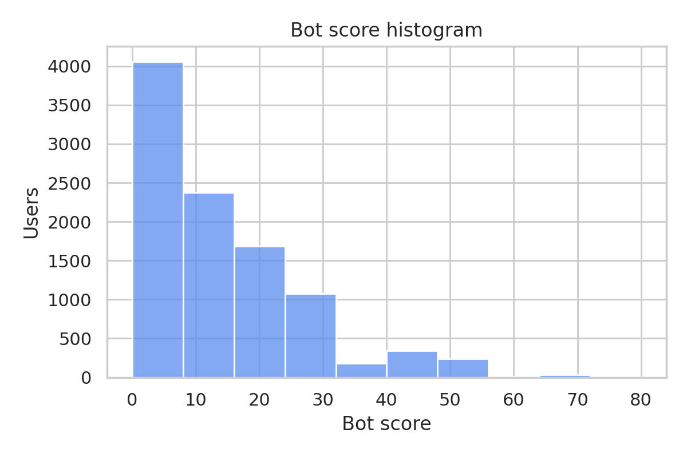
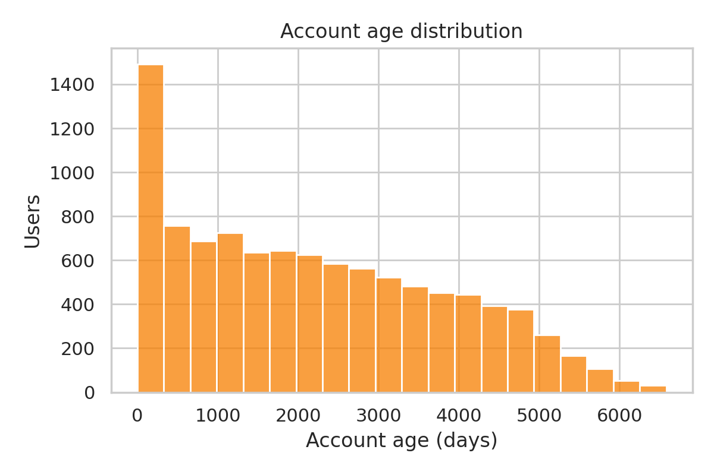
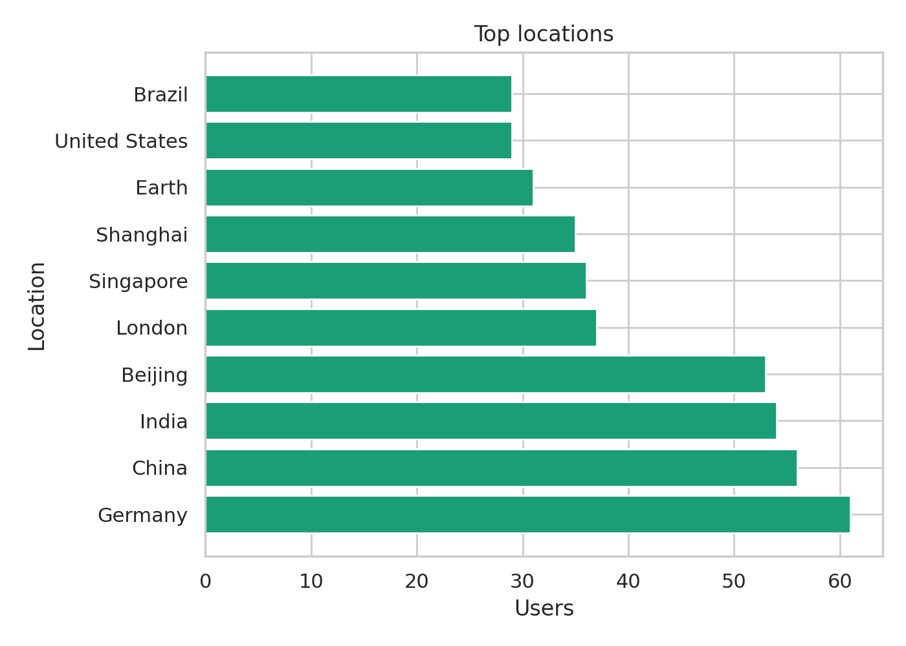
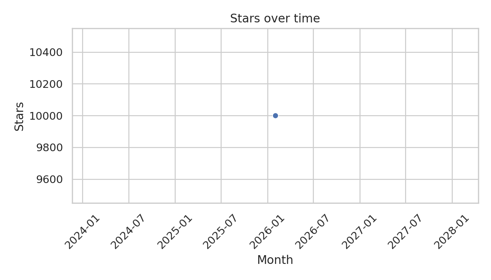

# Stargazer Bot Analysis for openclaw/openclaw

## Executive Summary
- Total stargazers analyzed: **10000**
- Enrichment coverage: **10,000/10,000 users (100.00%)**
- Likely bots (score ≥60): **47 (0.5%)**
- Suspicious (score 40–59): **581 (5.8%)**
- Likely human (score ≤39): **9372 (93.7%)**
- Top locations: Germany (61), China (56), India (54), Beijing (53), London (37)

## Methodology
- Fetched stargazers via GitHub GraphQL with deterministic pagination and rate-limit handling.
- Stored normalized records in SQLite and computed metrics via `metrics.py` version `bot-v1`.
- Optional REST enrichment provided site admin status, websites, and public events sampling.

## Bot Model
- Heuristic scoring spanning account type, naming patterns, profile completeness, social graph,
  activity, and repository/gist presence.
- Key thresholds: +80 for GitHub Bot accounts, +25 for accounts younger than 7 days,
  +10 for blank profiles, −30 for site-admin verified staff.

## Results
- Average account age: **2209 days** (enriched sample).
- Average followers: **16.7** (enriched sample).
- Public event sampling coverage: **0.0%** of users.
- 
- 
- 
- 
- 

## Validation
- Manual spot checks recommended for high-scoring accounts.
- Event sampling inspects recent public activity but omits private/org events.

## Limitations
- GitHub profiles may omit key signals (location, company).
- Heuristic classifier is deterministic and can mislabel niche communities.
- Event sampling capped to recent public events; dormant users may be legitimate.

## Appendix
- Data exports available in `reports/data`.
- Figures saved in `reports/figures`.
- Report generated at 2026-02-21 23:22 UTC.